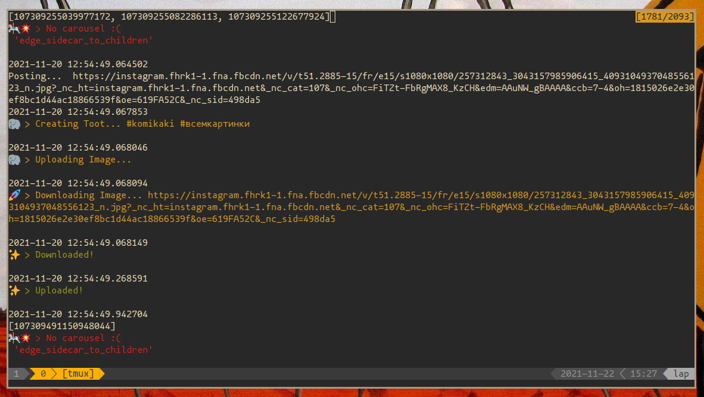

# Instagram2Fedi <span></span>

Simple tool for crossposting posts from instagram to Mastodon/Pixelfed.

## Using without docker
See [Docs.md](./Docs.md)

## Using docker-compose

1. create `docker-compose.yaml` with following content
``` yaml
version: '3'
services:
  bot:
    build:
      context: .
    image: "horhik/instagram2fedi:latest"
    environment:
      - YOUR_CONTAINER_NAME=<whatever>
      - I2M_INSTAGRAM_USER=<instgram username>
      - I2M_INSTANCE=<mastodon or pixelfed instance>
      - I2M_TOKEN=<your token here>
      - I2M_CHECK_INTERVAL=3600 #1 hour    
      - I2M_POST_INTERVAL=3600 #1 hour   
      - I2M_USE_MASTODON=4 #max carouse    - is 4, if there's no limit set to -1
      - I2M_FETCH_COUNT=5 # how many instagram posts to fetch per check_interval   -
```

2. And edit environment variables

3. Run `docker-compose up -d`


## Using with Dockerfile

Just clone repo, specify variables and run it.
You can write all needed variables in `./env.sh` and then do `source ./run.sh`

``` bash
git clone https://github.com/horhik/instagram2fedi
cd instagram2fedi
nano ./env.sh
source ./run.sh
```





